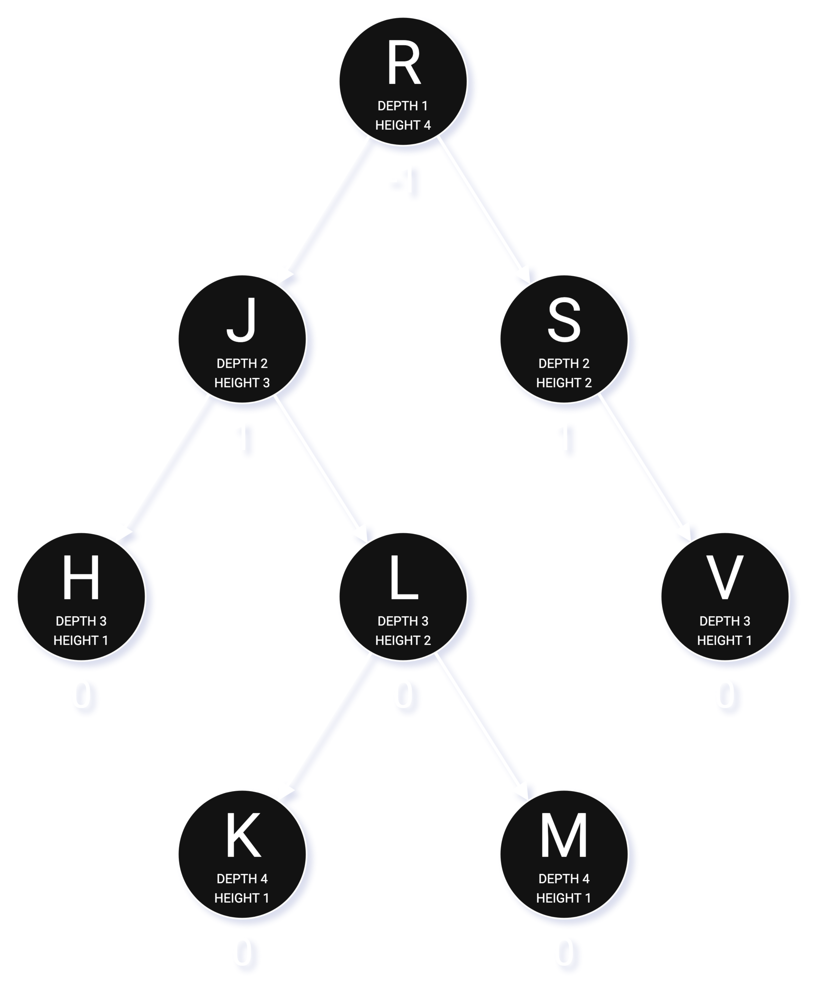

# My attempt at implementing an AVL tree in Rust.

## Overview
When implementing an AVL tree, there are some choices:
* Storing the parent pointer in a node or not.
* Storing the balance factor or height in a node.
* Taking a recursive or iterative approach.

This is a recursive implementation of an AVL tree that stores the height in a node
and does not store the parent pointer in it. Key points:
* Written in pure Rust.
* No `unsafe` code (other than the [mutable iterator](src/avl.rs#L544)).
* The key type can be any type that has `Ord`.
* Each node is identified by a key, and so there are no nodes with the same key.

## Description
<picture>
  <source media="(prefers-color-scheme: dark)" srcset="img/AVLTreeDarkTheme.png">
  <source media="(prefers-color-scheme: light)" srcset="img/AVLTreeLightTheme.png">
  
</picture>

**A diagram of an AVL tree with a balance factor labeled below each node.**

The AVL tree, named after its inventors, is a self-balancing binary search tree (BST)
that has a worst-case time complexity of $O(log(n))$ on lookup, insertion, and deletion.

An ordinary (unbalanced) BST has a worst-case time complexity of $O(n)$ for the basic operations.
Without rebalancing, the tree height keeps increasing on insertion,
and the performance degrades to that of a linked list, that is, linear time.

Therefore, rebalancing through tree rotations is necessary to keep the useful property of BSTs.

Here is an
[interactive tool to visualize how AVL trees work](https://www.cs.usfca.edu/~galles/visualization/AVLtree.html).

## Definitions
Below I provide the definitions used throughout this repository.

### Depth
The depth of a node is the depth of its parent plus one. An empty node's depth is zero.
A root node has no parent, thus its depth is $0 + 1 = 1$.[^1]

### Height
The height of a node $X$ is the maximum of the heights of its children plus one:
```math
Max(Height(LeftSubtree(X)), Height(RightSubtree(X))) + 1
```

An empty node's height is zero. A leaf node has no children, thus its height is $Max(0, 0) + 1 = 1$.[^2]

The height of a tree is the height of its root node. An empty tree (tree with no nodes) has a height of zero.
In the diagram above, the height of the root node $R$, four, is the height of the tree.[^3]

### Balance factor
Every node in an AVL tree has an integer called the balance factor.
The balance factor of a node X is the height of its right subtree minus the height of its left subtree:
```math
BF(X) = Height(RightSubtree(X)) - Height(LeftSubtree(X))
```

For a node $X$:
* if $BF(X) < 0$, $X$ is called "left-heavy".
* if $BF(X) > 0$, $X$ is called "right-heavy".
* if $BF(X) = 0$, $X$ is simply called "balanced".

In the diagram above, the root node $R$ is left-heavy, since $BF(R) = Height(S) - Height(J) = 2 - 3 = -1$.

[^1]: This differs from the usual definition, where a root's depth is zero.
[^2]: This differs from the usual definition, where a leaf's height is zero.
[^3]: In the usual definition, it's three.

## Implementation notes
The [iterative implementation](../iterative) is slightly faster, but uses `unsafe` code
and is more complex because it requires tracing the path of ancestor nodes during tree modification.

All primitive integer types have `Ord`, so they can be used as the key type. So does `String`, since it has `Ord`.

IEEE 754 floating-point arithmetic has a special value called "Not a Number" (NaN),
which is not equal to anything, not even to itself.
Because NaN violates the [trichotomy](https://en.wikipedia.org/wiki/Law_of_trichotomy),
floating-point types like `f32` cannot have `Ord`, so they cannot be used as the key type.

A key-value pair is stored in the node itself.
During a tree rotation, everything of the node is swapped with another (using `std::mem::swap`).
Therefore, if the key or value were large, expensive memory copies might take place during insertion or deletion.

## License
All code, including the [test module](src/avl_test.rs), is released under the MIT license.

The diagram above is my own work and is released into the public domain
([CC0](https://creativecommons.org/publicdomain/zero/1.0/)).
